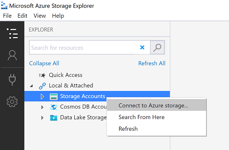
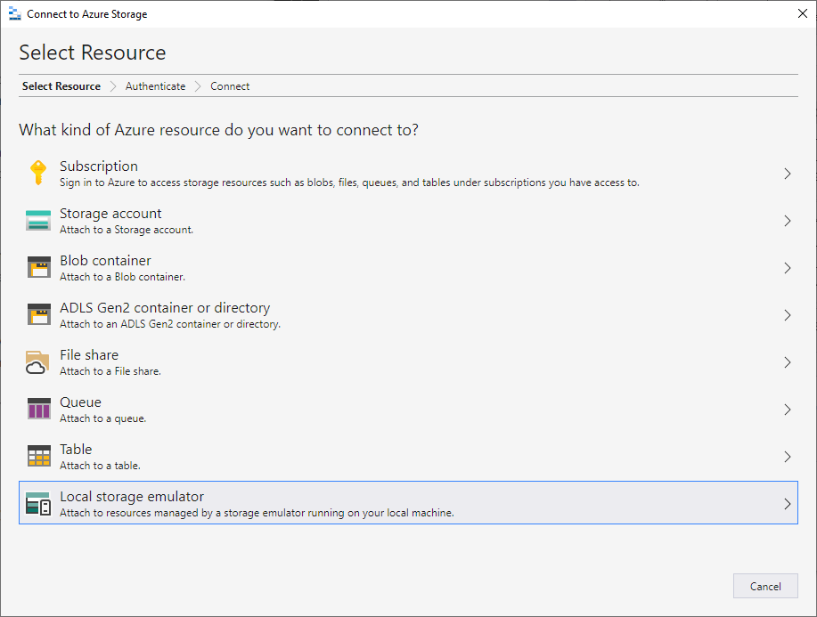
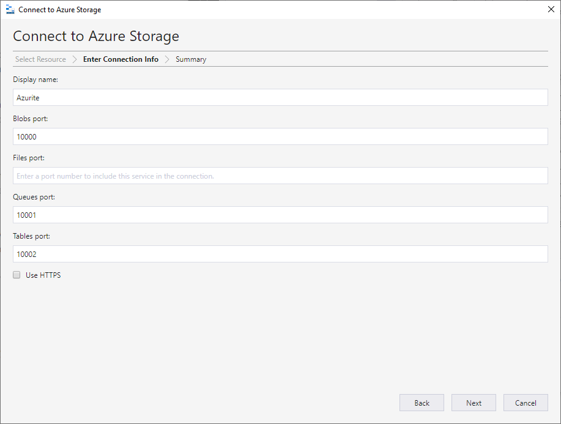
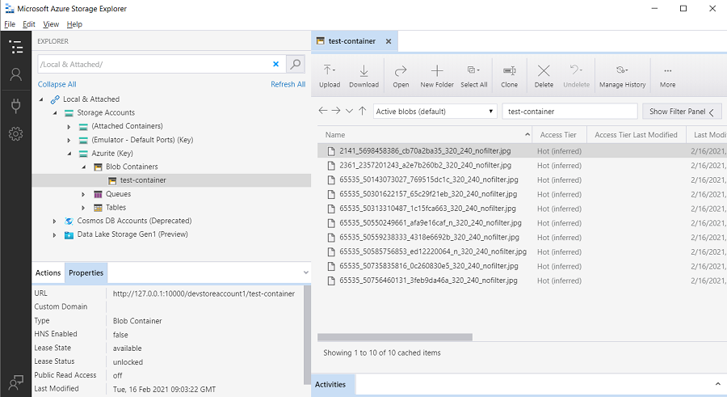
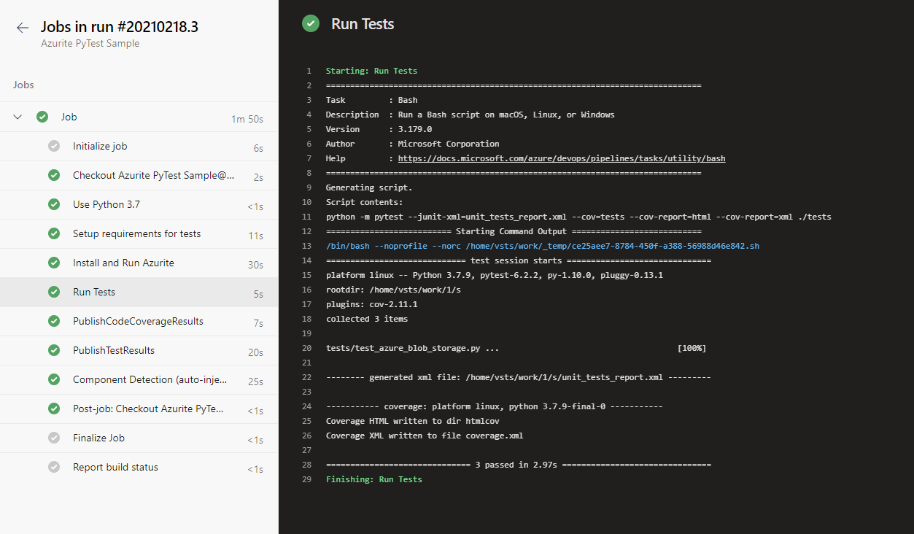

# Using Azurite to run blob storage tests in Azure DevOps Pipeline

## Overview

This repo determines the approach for writing automated tests with a short feedback loop (i.e. unit tests) against security considerations (private endpoints) for the Azure Blob Storage functionality.

Once private endpoints are enabled for the Azure Storage accounts, the current tests will fail when executed locally or as part of a pipeline because this connection will be blocked.

In this repo you can find a sample for Azure Blob Storage to upload images from url and upload files from a local folder. To run, `cp sample_env.txt .env` file to load environment variables for running code on local or pipeline and using `conftest.py` to load environment variables for tests.

Here's the folder structure for the sample:

- `build`
  - `azure-pipelines.yml` - Azure Pipelines yaml file
- `data` - Local files examples to be uploaded to Blob Storage
- `src`
  - `azure_blob_storage.py` - Azure Blob Storage Sample Code
- `tests`
  - `conftest.py` - Configuration file for running tests
  - `test_azure_blob_storage.py` - Azure Blob Storage Test Code
- `.env` - Environment variable files for Blob Storage
- `docker-compose.yml` - Docker Compose yaml file to run Azurite Docker Image
- `requirements.txt` - Required pip packages to run python code on your local and pipeline
- `requirements_dev.txt` - Required pip packages to run test code on your local and pipeline

## Getting Started
### Install and Launch Azurite on local
There are several different ways to install and run Azurite on your local system as listed [here](https://docs.microsoft.com/en-us/azure/storage/common/storage-use-azurite#install-and-run-azurite-by-using-npm). In this document we will cover `Install and run Azurite using NPM` and `Install and run the Azurite Docker image`.
#### a. Using NPM
In order to run Azurite V3 you need Node.js >= 8.0 installed on your system. Azurite works cross-platform on Windows, Linux, and OS X.

After the Node.js installation, you can install Azurite simply with npm which is the Node.js package management tool included with every Node.js installation.

```bash
# Install Azurite
npm install -g azurite

# Create azurite directory
mkdir c:/azurite

# Launch Azurite for Windows
azurite --silent --location c:\azurite --debug c:\azurite\debug.log

#Launch Azurite for MacOs:
azurite -s -l /usr/local/lib/node_modules/azurite -d /usr/local/lib/node_modules/azurite/debug.log
```

#### b. Using docker image
Docker Compose will run the docker image using the `docker-compose.yml` file.

```bash
docker-compose up 
```

Either option (a) Using NPM  or (b) Using docker image, the output should be:
```shell
Azurite Blob service is starting at http://127.0.0.1:10000
Azurite Blob service is successfully listening at http://127.0.0.1:10000
Azurite Queue service is starting at http://127.0.0.1:10001
Azurite Queue service is successfully listening at http://127.0.0.1:10001
```

### Run tests on local

Python 3.8 is used for this, but it should also work fine on other 3.6+ versions.

1. To test and see how these endpoints are running, you can attach your local blob storage to the [**Azure Storage Explorer**](https://azure.microsoft.com/en-us/features/storage-explorer/). In Azure Storage Explorer:  

- right click on `Storage Accounts` and select `Connect to Azure Storage`
      

- then select `Attach to a local emulator`  
    

2. Provide a Display name and port number, then your connection will be ready and you can use Storage Explorer to manage your local blob storage.  
    

Do not forget to start your emulator, Storage Explorer will not start it for you.

3. Create a virtual python environment 

   `python3 -m venv env`  
   `source env/bin/activate` [on Linux] or `env/scripts/activate` [on Windows]  

4. Install the dependencies  
  `pip3 install -r requirements_dev.txt`
    
5. Run tests:

   ```bash
   python3 -m pytest ./tests
   ```

After the tests run, you can see the files in your local blob storage



## Run tests on Azure DevOps Pipelines

After successfully running tests on local, run the `azure-pipelines` build yaml file using Azure DevOps Pipelines.

**Note:** You will need
* an existing [Azure subscription](https://azure.microsoft.com/en-us/free/)
* an existing [Azure DevOps](https://azure.microsoft.com/en-us/services/devops/) organization and project.

1. Login to Azure DevOps

2. Under the Organisation and Project, select the sample folder git Repo and Configure a Pipeline using the `build/azure-pipelines.yml` 

3. Run the Pipeline 

After a successful set up and running the pipeline in Azure DevOps Pipelines, the result should be like below:


